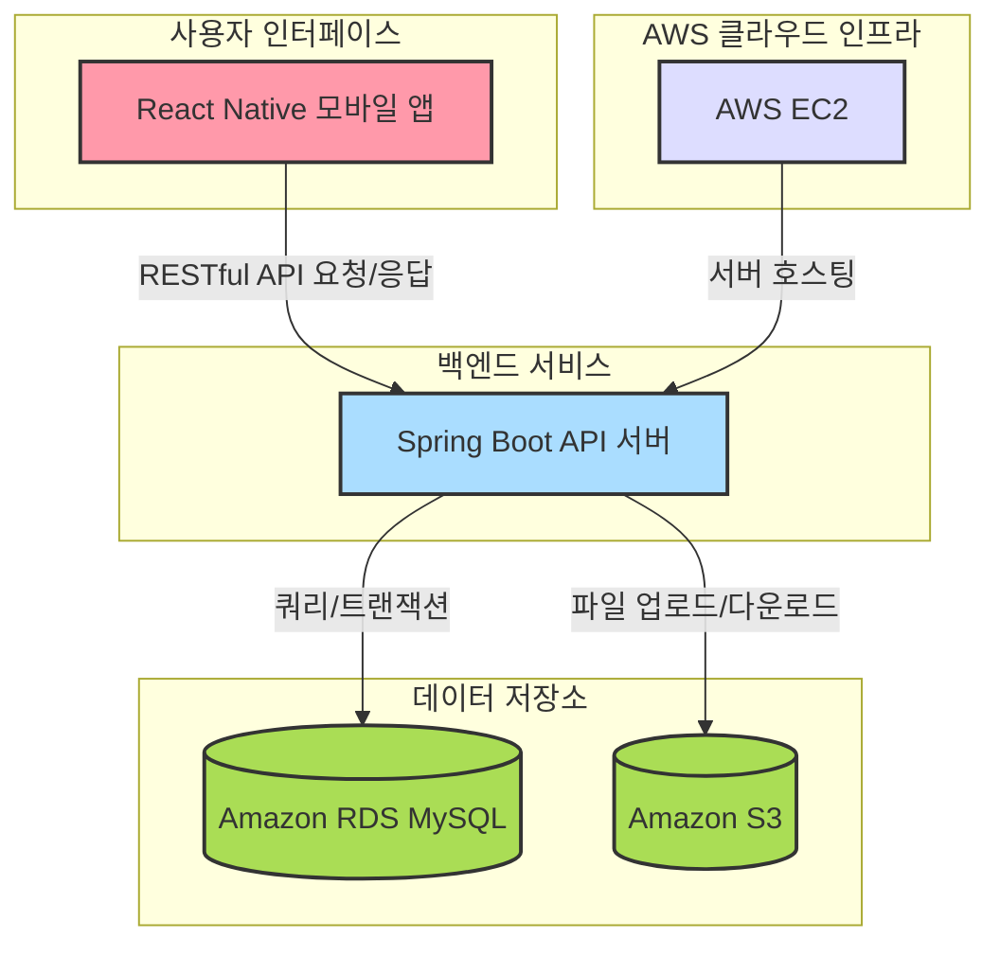

## 새싹식권

####  피그마
[✅Figma](https://www.figma.com/design/3dq3FoAhTIkBIHcORUm5cR/SeSAC?node-id=22-58&p=f&t=6piaK3X8gYBbYmnI-0)
   

## 📽️ 프로젝트 소개

### 📍 프로젝트 주제

**새싹식권**은 **가맹된** 음식점 및 상점에서 포인트 결제를 통해 서비스를 이용할 수 있는 디지털 식권 서비스입니다. 사용자는 모바일 앱을 통해 손쉽게 결제할 수 있으며, 가맹점은 결제 정보와 정산 정보를 조회하는 등의 서비스를 이용할 수 있습니다.

### 📍 개요

**새싹식권**은 사용자와 가맹점 간의 효율적인 결제 시스템을 제공하는 플랫폼입니다. 모바일 앱을 통해 사용자는 디지털 포인트로 결제하고, 가맹점은 결제 내역과 정산 내역을 확인할 수 있습니다. 관리자(고객)는 사용자의 포인트 충전, 결제 내역 확인, 가맹점에 대한 포인트 정산 기능을 통해 원활한 서비스 운영을 지원합니다. 또한, 가맹점은 사용자가 포인트로 결제한 내역과 잔액을 관리하고, 정산 내역을 조회할 수 있습니다.

### 📍 주요기능 

---

#### 🧑‍💼 사용자 기능
- **계정**
  - 로그인
  - 로그아웃
  - 비밀번호 변경
  - 개인정보 조회
- **포인트**
  - 포인트 조회
- **결제 내역**
  - 결제내역 조회
- **가맹점 이용**
  - 결제
  - 가맹점 목록 조회
  - 가맹점 메뉴 사진 조회
  - 가맹점 지도

---

#### 🏪 가맹점 기능
- **계정**
  - 로그인
  - 로그아웃
  - 비밀번호 변경
  - 정보 조회
- **메뉴 관리**
  - 메뉴 사진 등록/수정
  - 메뉴 사진 조회
- **결제 관리**
  - 결제 내역 조회
  - 결제 취소
  - 정산 기록 조회
  - 정산 통계 조회

---

#### 🛠 고객(관리자) 기능
- **계정**
  - 로그인
  - 로그아웃
- **사용자 관리**
  - 사용자 추가
  - 사용자 목록 조회
  - 사용자 수정
  - 사용자 비활성화
- **포인트 관리**
  - 포인트 지급
  - 포인트 수정
- **그룹 관리**
  - 그룹 목록 조회
  - 그룹 등록
  - 그룹 수정
  - 그룹 비활성화
  - 사용자 추가
  - 사용자 제거
- **가맹점 관리**
  - 가맹점 목록 조회
  - 가맹점 추가
  - 가맹점 상세 조회
  - 가맹점 수정
  - 가맹점 비활성화
- **거래 관리**
  - 거래 내역 조회
- **정산 관리**
  - 정산 내역 조회
  - 정산

---

### 🧑‍🤝‍🧑 맴버 구성

| 이름    | GitHub 링크                                         | 
|---------|-----------------------------------------------------|
| 이형민  | [이형민](https://github.com/Lidoca)           |
| 배연주  | [배연주](https://github.com/kimyeonghee)            |
| 조성진  | [조성진](https://github.com/choseongjin0815)        |

---

## 기술 스택 및 사용 목적

⸻

## 🧰 기술 스택 및 사용 목적

### 💻 백엔드

| 기술 | 설명 |
|------|------|
| **Java (JDK 17)** | 안정성과 성능이 검증된 최신 LTS 버전. 유지보수 및 최신 기능 활용 가능 |
| **Spring Boot** | REST API 서버 구축에 사용. 설정이 간편하고 빠른 개발 지원 |
| **Spring Data JPA** | CRUD 자동화 및 객체지향적인 DB 접근 방식 제공 |
| **QueryDSL** | 동적 쿼리 생성 시 타입 안정성과 가독성 확보 |
| **MySQL** | 관계형 DBMS로 정형 데이터 저장 및 트랜잭션 처리에 강점 |
| **Redis** | 리프레시 토큰 저장소로 사용. 빠른 속도와 TTL 기반 자동 만료 관리 |
| **Swagger** | API 명세 자동화 도구. 프론트/백엔드 간 명확한 협업 지원 |

---

### ☁️ 인프라 & 클라우드

| 기술 | 설명 |
|------|------|
| **AWS EC2** | 백엔드 서버를 배포하고 외부 접속이 가능하도록 구성 |
| **AWS RDS (MySQL)** | 관리형 관계형 데이터베이스. 백업, 장애 복구 등 안정성 확보 |
| **AWS S3** | 이미지 및 정적 파일 저장소. 대용량 데이터 처리에 적합 |
| **Docker** | Redis 및 Spring Boot 컨테이너 구성으로 실행 환경 통일 및 이식성 확보 

---

### 📱 프론트엔드 (모바일 앱)

| 기술 | 설명 |
|------|------|
| **React Native** | 하나의 코드베이스로 iOS/Android 앱을 동시에 개발 가능 |
| **AsyncStorage** | 로컬에 토큰, 사용자 정보를 저장하여 로그인 유지 구현 |
| **Redux Toolkit** | 상태 관리 도구. 비동기 처리와 데이터 흐름 관리에 용이 |

---

### 🤝 협업 도구

| 도구 | 설명 |
|------|------|
| **GitHub** | 소스코드 버전 관리 및 협업 플랫폼 |
| **Jira** | 이슈 추적, 스프린트 관리, 업무 분배를 위한 프로젝트 관리 도구 |
| **Slack** | 팀원 간 실시간 커뮤니케이션을 위한 메신저 |

---

## 프로젝트 구조도
### 전체 구조

### ERD

