## 새싹식권

####  피그마
[✅Figma](https://www.figma.com/design/3dq3FoAhTIkBIHcORUm5cR/SeSAC?node-id=22-58&p=f&t=6piaK3X8gYBbYmnI-0)
   

## 📽️ 프로젝트 소개

### 📍 프로젝트 주제

**새싹식권**은 **가맹된** 음식점 및 상점에서 포인트 결제를 통해 서비스를 이용할 수 있는 디지털 식권 서비스입니다. 사용자는 모바일 앱을 통해 손쉽게 결제할 수 있으며, 가맹점은 결제 정보와 정산 정보를 조회하는 등의 서비스를 이용할 수 있습니다.

### 📍 개요

**새싹식권**은 사용자와 가맹점 간의 효율적인 결제 시스템을 제공하는 플랫폼입니다. 모바일 앱을 통해 사용자는 디지털 포인트로 결제하고, 가맹점은 결제 내역과 정산 내역을 확인할 수 있습니다. 관리자(고객)는 사용자의 포인트 충전, 결제 내역 확인, 가맹점에 대한 포인트 정산 기능을 통해 원활한 서비스 운영을 지원합니다. 또한, 가맹점은 사용자가 포인트로 결제한 내역과 잔액을 관리하고, 정산 내역을 조회할 수 있습니다.

### 📍 주요기능 

---

#### 🧑‍💼 사용자 기능
- **계정**
  - 로그인
  - 로그아웃
  - 비밀번호 변경
  - 개인정보 조회
- **포인트**
  - 포인트 조회
- **결제 내역**
  - 결제내역 조회
- **가맹점 이용**
  - 결제
  - 가맹점 목록 조회
  - 가맹점 메뉴 사진 조회
  - 가맹점 지도

---

#### 🏪 가맹점 기능
- **계정**
  - 로그인
  - 로그아웃
  - 비밀번호 변경
  - 정보 조회
- **메뉴 관리**
  - 메뉴 사진 등록/수정
  - 메뉴 사진 조회
- **결제 관리**
  - 결제 내역 조회
  - 결제 취소
  - 정산 기록 조회
  - 정산 통계 조회

---

#### 🛠 고객(관리자) 기능
- **계정**
  - 로그인
  - 로그아웃
- **사용자 관리**
  - 사용자 추가
  - 사용자 목록 조회
  - 사용자 수정
  - 사용자 비활성화
- **포인트 관리**
  - 포인트 지급
  - 포인트 수정
- **그룹 관리**
  - 그룹 목록 조회
  - 그룹 등록
  - 그룹 수정
  - 그룹 비활성화
  - 사용자 추가
  - 사용자 제거
- **가맹점 관리**
  - 가맹점 목록 조회
  - 가맹점 추가
  - 가맹점 상세 조회
  - 가맹점 수정
  - 가맹점 비활성화
- **거래 관리**
  - 거래 내역 조회
- **정산 관리**
  - 정산 내역 조회
  - 정산

---

### 🧑‍🤝‍🧑 맴버 구성

| 이름    | GitHub 링크                                         | 
|---------|-----------------------------------------------------|
| 이형민  | [이형민](https://github.com/Lidoca)           |
| 배연주  | [배연주](https://github.com/kimyeonghee)            |
| 조성진  | [조성진](https://github.com/choseongjin0815)        |

---

## 기술 스택 및 사용 목적

**백엔드**

- **Spring Boot**  
  Java 기반의 웹 애플리케이션 프레임워크로, 빠른 개발과 유지보수를 위해 선택했습니다.
  
- **Java (JDK 17)**  
  안정성과 성능이 검증된 언어로, 최신 LTS 버전인 JDK 17을 사용하여 장기적인 유지보수와 최신 기능 활용이 가능합니다.

- **MySQL**  
  구조화된 데이터 저장과 효율적인 쿼리 처리를 위해 관계형 데이터베이스인 MySQL을 도입했습니다. 대용량 데이터 처리와 트랜잭션 관리에 강점을 가집니다.

- **Amazon RDS (MySQL)**  
  데이터베이스 운영의 복잡성을 줄이고, 자동 백업 및 장애 복구 등 관리 편의성을 위해 AWS RDS를 사용했습니다.

- **AWS EC2**  
  백엔드 서버와 애플리케이션을 안정적으로 배포하고 운영하기 위해 EC2 인스턴스를 활용했습니다.

- **Amazon S3**  
  이미지, 파일 등 정적 자산을 안전하게 저장하고, 대용량 파일 관리 및 배포를 위해 S3를 사용합니다. 높은 내구성과 확장성을 제공합니다.

**프론트엔드**

- **React Native**  
  iOS와 Android 모두에서 동작하는 크로스 플랫폼 모바일 앱 개발을 위해 React Native를 선택했습니다. 코드 재사용성과 빠른 개발 주기가 장점입니다.

**API 문서화**

- **Swagger**  
  API 명세 자동화 및 문서화를 위해 Swagger를 도입했습니다. 개발자 간 소통을 원활하게 하고, 클라이언트-서버 간 인터페이스를 명확히 정의할 수 있습니다.

**협업 도구**

- **Jira**  
  프로젝트 관리와 이슈 추적을 체계적으로 하기 위해 Jira를 사용했습니다. 스프린트 관리, 업무 분배, 진행 상황 파악에 효과적입니다.

- **Slack**  
  팀원 간 실시간 커뮤니케이션과 빠른 피드백을 위해 Slack을 활용했습니다. 

- **GitHub**  
  소스 코드 버전 관리와 협업을 위해 GitHub를 사용했습니다.

**기타 라이브러리 및 기술**

- **QueryDSL**  
  복잡하고 동적인 쿼리 생성을 위해 QueryDSL을 도입했습니다. 타입 안전성과 가독성이 높아 유지보수에 유리합니다.

- **Spring Data JPA**  
  데이터베이스 접근을 추상화하고, 반복적인 CRUD 코드 작성을 줄이기 위해 Spring Data JPA를 사용했습니다.

---

## 프로젝트 구조도
### 전체 구조

```mermaid
graph TB
  subgraph "사용자 인터페이스"
    RN[React Native 모바일 앱]
  end

  subgraph "백엔드 서비스"
    API[Spring Boot API 서버]
  end

  subgraph "데이터 저장소"
    RDS[(Amazon RDS MySQL)]
    S3[(Amazon S3)]
  end

  subgraph "AWS 클라우드 인프라"
    EC2[AWS EC2]
  end

  RN -- "RESTful API 요청/응답" --> API
  API -- "쿼리/트랜잭션" --> RDS
  API -- "파일 업로드/다운로드" --> S3
  EC2 -- "서버 호스팅" --> API

  classDef mobile fill:#f9a,stroke:#333,stroke-width:2px;
  classDef backend fill:#adf,stroke:#333,stroke-width:2px;
  classDef database fill:#ad5,stroke:#333,stroke-width:2px;
  classDef cloud fill:#ddf,stroke:#333,stroke-width:2px;

  class RN mobile;
  class API backend;
  class RDS,S3 database;
  class EC2 cloud;
```

### ERD

