## 새싹식권

####  피그마
[✅Figma](https://www.figma.com/design/3dq3FoAhTIkBIHcORUm5cR/SeSAC?node-id=22-58&p=f&t=6piaK3X8gYBbYmnI-0)
   

## 📽️ 프로젝트 소개

### 📍 프로젝트 주제

**새싹식권**은 **가맹된** 음식점 및 상점에서 포인트 결제를 통해 서비스를 이용할 수 있는 디지털 식권 서비스입니다. 사용자는 모바일 앱을 통해 손쉽게 결제할 수 있으며, 가맹점은 결제 정보와 정산 정보를 조회하는 등의 서비스를 이용할 수 있습니다.

### 📍 개요

**새싹식권**은 사용자와 가맹점 간의 효율적인 결제 시스템을 제공하는 플랫폼입니다. 모바일 앱을 통해 사용자는 디지털 포인트로 결제하고, 가맹점은 결제 내역과 정산 내역을 확인할 수 있습니다. 관리자(고객)는 사용자의 포인트 충전, 결제 내역 확인, 가맹점에 대한 포인트 정산 기능을 통해 원활한 서비스 운영을 지원합니다. 또한, 가맹점은 사용자가 포인트로 결제한 내역과 잔액을 관리하고, 정산 내역을 조회할 수 있습니다.

### 📍 주요기능 

---

#### 🧑‍💼 사용자 기능
- **계정**
  - 로그인
  - 로그아웃
  - 비밀번호 변경
  - 개인정보 조회
- **포인트**
  - 포인트 조회
- **결제 내역**
  - 결제내역 조회
- **가맹점 이용**
  - 결제
  - 가맹점 목록 조회
  - 가맹점 메뉴 사진 조회
  - 가맹점 지도

---

#### 🏪 가맹점 기능
- **계정**
  - 로그인
  - 로그아웃
  - 비밀번호 변경
  - 정보 조회
- **메뉴 관리**
  - 메뉴 사진 등록/수정
  - 메뉴 사진 조회
- **결제 관리**
  - 결제 내역 조회
  - 결제 취소
  - 정산 기록 조회
  - 정산 통계 조회

---

#### 🛠 고객(관리자) 기능
- **계정**
  - 로그인
  - 로그아웃
- **사용자 관리**
  - 사용자 추가
  - 사용자 목록 조회
  - 사용자 수정
  - 사용자 비활성화
- **포인트 관리**
  - 포인트 지급
  - 포인트 수정
- **그룹 관리**
  - 그룹 목록 조회
  - 그룹 등록
  - 그룹 수정
  - 그룹 비활성화
  - 사용자 추가
  - 사용자 제거
- **가맹점 관리**
  - 가맹점 목록 조회
  - 가맹점 추가
  - 가맹점 상세 조회
  - 가맹점 수정
  - 가맹점 비활성화
- **거래 관리**
  - 거래 내역 조회
- **정산 관리**
  - 정산 내역 조회
  - 정산

---

### 🧑‍🤝‍🧑 맴버 구성

| 이름    | GitHub 링크                                         | 
|---------|-----------------------------------------------------|
| 이형민  | [이형민](https://github.com/Lidoca)           |
| 배연주  | [배연주](https://github.com/kimyeonghee)            |
| 조성진  | [조성진](https://github.com/choseongjin0815)        |

---

## 기술 스택 및 사용 목적

⸻

🧱 기술 스택 및 사용 목적

💻 백엔드

기술	설명
Java (JDK 17)	안정성과 성능이 검증된 최신 LTS 버전. 유지보수 및 신기능 활용에 유리
Spring Boot	REST API 서버 구축을 위한 핵심 프레임워크. 빠른 개발과 설정 최소화
Spring Data JPA	반복적인 CRUD 코드 제거 및 객체지향적인 DB 접근 방식 제공
QueryDSL	동적 쿼리를 타입 안정성과 함께 구현. 복잡한 조건 처리에 유용
MySQL	관계형 DBMS로 구조화된 데이터 저장 및 트랜잭션 처리에 강점
Redis	리프레시 토큰 저장소로 사용. 빠른 캐시 성능과 TTL 기반 만료 관리
Swagger	API 문서 자동화. 프론트-백 협업을 위한 명세 공유 도구

⸻

☁️ 인프라 / 클라우드

기술	설명
AWS EC2	백엔드 서버를 호스팅하여 외부와 통신할 수 있는 환경 제공
AWS RDS (MySQL)	DB 운영의 자동화 및 안정성 확보. 백업, 복구, 확장성 우수
AWS S3	이미지 및 정적 파일 저장소. 고내구성 및 퍼블릭 접근 최적화
Docker	Redis, Spring Boot 서버를 컨테이너화. 환경 통일성 및 배포 편의성 확보※ CI/CD는 적용하지 않음

⸻

📱 프론트엔드 (모바일)

기술	설명
React Native	iOS/Android 앱 동시 개발. 코드 재사용성과 빠른 배포 가능
AsyncStorage	모바일 로컬에 토큰 및 사용자 정보 저장. 로그인 상태 유지 등 활용

⸻

🛠 협업 도구

도구	설명
GitHub	소스코드 버전 관리 및 협업
Jira	프로젝트 일정 및 태스크 관리
Slack	팀원 간 실시간 커뮤니케이션

⸻

## 프로젝트 구조도
### 전체 구조

```mermaid
graph TB
  subgraph "사용자 인터페이스"
    RN[React Native 모바일 앱]
  end

  subgraph "백엔드 서비스"
    API[Spring Boot API 서버]
  end

  subgraph "데이터 저장소"
    RDS[(Amazon RDS MySQL)]
    S3[(Amazon S3)]
  end

  subgraph "AWS 클라우드 인프라"
    EC2[AWS EC2]
  end

  RN -- "RESTful API 요청/응답" --> API
  API -- "쿼리/트랜잭션" --> RDS
  API -- "파일 업로드/다운로드" --> S3
  EC2 -- "서버 호스팅" --> API

  classDef mobile fill:#f9a,stroke:#333,stroke-width:2px;
  classDef backend fill:#adf,stroke:#333,stroke-width:2px;
  classDef database fill:#ad5,stroke:#333,stroke-width:2px;
  classDef cloud fill:#ddf,stroke:#333,stroke-width:2px;

  class RN mobile;
  class API backend;
  class RDS,S3 database;
  class EC2 cloud;
```

### ERD

